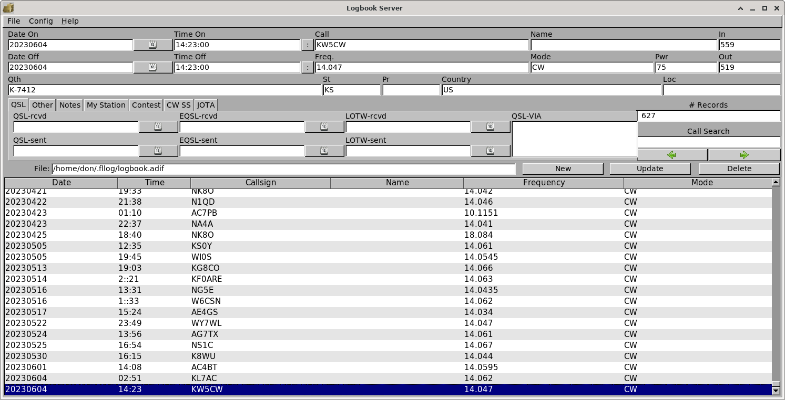
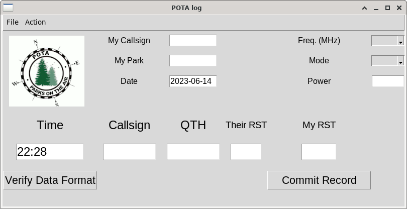

# POTA Logger
#### Video Demo:  <URL HERE>
#### github: https://github.com/donlevey/POTAlog.py
#### Description: A lightweight, simple Ham Radio Logger for POTA activations

# The Idea:    
## Background
With about 2 million amateur radio operators worldwide, and over 760,000 in the US alone, ham radio is a hobby which  has existed for well over 100 years.  In recent decades, however, it has seen significant challenge from the internet and from wireless phones, as easier communication methods have been developed and have gained popularity.  Indeed, the once-novel idea of talking to people from around the world seems a bit quaint now that people regularly chat, send email, and even take college classes over networks.  That said, ham radio operators are often at the front lines of newly-developing technology and interesting uses of existing technology (for example, satellite communication, or talking to people on the International Space Station).  A significant group within hams concentrates on low-power communication (“QRP”) and portable operations.  This has resulting in a quickly-growing program known as Parks On The Air (POTA).  


## What is POTA?
The POTA goal is to encourage radio operators out of their basements and into the fresh air, in state and national parks, where they try to make as many contacts as possible during their time out  These operators “activate” a park for an hour, a day, or an entire weekend (or week).  Complementing this group are POTA hunters, people who seek out POTA activators.  Indeed, there can be large pileups (many people trying to contact at once) as activators work each hunter in turn.  Like many hobbies, activators often spend lots of time (and money) building their “kit,” with just the right radio, antenna, and other gear.

### To quote from the POTA website:
> Parks on the Air® (POTA) started in early 2017 when the ARRL’s National Parks on the Air special event ended. A group of volunteers wanted to continue the fun beyond the one-year event, and thus, POTA was born.
> (https://parksontheair.com/)

## What is the need seen?
One area in which there has been a gap has been with logging.  Traditionally, hams have kept logs of each contact made, as well as exchanging cards confirming the contact (or uploading electronic copies of their logs to certain websites which maintain on-line records).  As technology marches forward, there have been many applications which can maintain logs on a computer.  However, in a situation where an operator is moving quickly, there is often no time to exchange more than location and a signal report before moving on to the next person.  This exposes a weakness of many packages: they are too complex, and are not optimized for this rapid operation.  This was the need which drove me to write this application, POTA_log.  I have set this up so that the necessary information can be taken down with a minimum of fuss, and preserved (or uploaded) for the user's records.

### Here's a sample of an existing log program:


## Basic Project Info
The project itself is all contained in the “project.py” file, with tests for PyTest in the test_project.py file that accompanies.  The POTAlogo.gif file is used for the entry form itself.  Writing this project broke new ground for me, as I implemented a GUI in tkinter – something that was not discussed in class.  This in itself was a large learning experience as I navigated through basic principles and best practices on many different websites across the Internet.  In the end, while the interface itself may not be perfect, it is useful, and I consider the soon-to-be implemented improvements to be refinements rather than major changes or re-workings.  This also presented challenges when devising tests in PyTest; while it is possible to test GUI components in PyTest, this seemed a large enough can of worms that I concentrated on the internal workings for my tests.


## Notes
In fact, completing this project according to the specified instructions presented some interesting twists.  It appears to be common practice to encapsulate the GUI and its attendant functions within its own class, and then instantiate that class when running.  I was unable to implement this and still have the necessary functions at “main-level” in the project file.  Therefore, I brought the GUI functionality within the main() function, and moved most of the functions outside of main().  It is this functionality, testing the validity of the user's data, that makes up the bulk of under-the-covers processing.  Once the data is validated, it is output to a CSV file of the user's specification (or to the default location in the runtime directory).  In principle it is very simple, and yet much more complex than other programs we have written for this course.



# The Code:

### Intro, and setup in Main():

The global portion of the program is very small:
```
# Written in PyCharm on Fedora Linux

from datetime import datetime
import tkinter, csv, time
from tkinter import messagebox, filedialog, ttk

logfile = "POTA_log.csv"
```

The first three lines are import instructions, and the fourth is the initialization of a global variable.  I understand that this is not best practice, but I could think of no other way of passing this value in and out of the GUI; the function that creates the file selection dialog is not called in a way that permits a return value, and so I was left with updating the global variable should the user choose to change the default path/filename of the log file.  Were I to make this unchangeable, this could have been kept within main().


The next section starts main() itself:
```
def main():

    def commit(logfile, MyCallsign, MyPark, Power, Mode, Callsign, Freq, QTH, Date, Time, In_RST, Out_RST):
        isgood = verify_data("commit", Mode, Freq, In_RST, Out_RST)

        if isgood > 0:  return

        Date = format_date(Date)
        Time = format_time(Time)

        with open(logfile, 'a') as csvfile:
            filewriter = csv.writer(csvfile)
            filewriter.writerow((MyCallsign, MyPark, Power, Mode, Callsign, Freq, QTH, Date, Time, In_RST, Out_RST))

        entDate.delete(0, "end")
        entDate.insert(0, datetime.utcnow().date())
        entTime.delete(0, "end")
        entTime.insert(0, datetime.utcnow().strftime("%H:%M:%S"))
        entCallsign.delete(0, "end")
        entQTH.delete(0, "end")
        entOut_RST.delete(0, "end")
        entIn_RST.delete(0, "end")
```

The commit() function is defined, which is really the point of the whole exercise.  This is what calls the verify function to validate the format of all the entered data, and then writes the data out to the specified CSV file.  In between is a quick check to see if all the data is properly formatted; if not (via isgood), the commit is aborted due to errors.  If isgood reflects 0 errors, the next two commands ensure that the date and time are formatted properly.  These two fields are special, in that they are auto-filled on the form with a default date and time that is current at the time the screen is painted.  If they are changed, that value is validated, and if incorrect, is replaced by the current date/time at the point when the button has been pressed.  Otherwise the data in the field is used.  The date and bottom 5 fields are then cleared for entry, and the time and date are re-written with the current time and date at that moment.  The time is UTC time (Universal Coordinated Time, once known as GMT), which is the format used by the worldwide amateur radio community.  The date also reflects UTC, and change during operating hours, depending upon where on the earth the user is operating.

We then enter the setup for the main window and its attendant objects and functions:
```
root = tkinter.Tk()
root.geometry("800x350")
root.title("POTA log")

varMyCallsign   = tkinter.StringVar()
varMyPark       = tkinter.StringVar()
varMyPower      = tkinter.StringVar()
varMyMode       = tkinter.StringVar()
varCallsign     = tkinter.StringVar()
varFreq         = tkinter.StringVar()
varDate         = tkinter.StringVar()
varTime         = tkinter.StringVar()
varQTH          = tkinter.StringVar()
varIn_RST       = tkinter.StringVar()
varOut_RST      = tkinter.StringVar()

def capsMyCallsign(event):
    varMyCallsign.set(varMyCallsign.get().upper())

def capsMyPark(event):
    varMyPark.set(varMyPark.get().upper())

def capsCallsign(event):
    varCallsign.set(varCallsign.get().upper())

def capsQTH(event):
    varQTH.set(varQTH.get().upper())

def help_about():
    top = tkinter.Toplevel(root)
    top.geometry("300x50")
    top.title("About POTA_log")
    aboutwin = tkinter.Label(top, text="POTA_Log was written and copyright\nv0.1 by Don Levey, 2023", font=("Arial", 12))
    aboutwin.grid(row=2, column=0)

def on_closing():
    #    print("Goodbye Cruel World")
    if messagebox.askyesno(title="Quit?", message="Do you want to quit without saving?"):
        root.destroy()
```
First up is the creation of the main window object itself, using the tkinter GUI framework.  The window object is instantiated, its size is specified, and the title bar is given a title.  I then create 11 string variables which are used in the data fields; these allow me to get the entered values for manipulation and use later.  I then created a number of internal “helper” functions.  For consistency’s sake, I wanted to ensure that any alphabetic fields on the form would be capitalized; the capsXXXX() functions set each character in the field to upper case as soon as it is entered.  The help_about() function simply creates the “About…” window displayable via the Help menu.  I did not see the need for any fancy formatting at this time.  The last function is on_closing(), and is what is used by the GUI to query whether the user wants to exit.  This function is called from the File → Exit menu option, as well as when the user clicks on the “X” at the top-right of the window.  This is bypassed if the user selects “Exit Without Question” from the File menu.

From there we move to the mechanics of the window population:
```
menubar = tkinter.Menu(root)

filemenu = tkinter.Menu(menubar, tearoff=0)
filemenu.add_command(label="Set Logfile", command=set_logfile)
filemenu.add_command(label="Close", command=on_closing)
filemenu.add_separator()
filemenu.add_command(label="Close Without Question", command=exit)

actionmenu = tkinter.Menu(menubar, tearoff=0)
actionmenu.add_command(label="Commit Record", command = lambda: commit(logfile,  entMyCallsign.get(), entMyPark.get(), entPower.get(), entMode.get(), entCallsign.get(), entFreq.get(), entQTH.get(), entDate.get(), entTime.get(), entIn_RST.get(), entOut_RST.get()))

helpmenu = tkinter.Menu(menubar, tearoff=0)
helpmenu.add_command(label="About...", command=help_about)

menubar.add_cascade(menu=filemenu, label="File")
menubar.add_cascade(menu=actionmenu, label="Action")
menubar.add_cascade(menu=helpmenu, label="Help")

root.config(menu=menubar)

root.columnconfigure(0, weight=30)
root.columnconfigure(1, weight=20)
root.columnconfigure(2, weight=20)
root.columnconfigure(3, weight=50)
root.columnconfigure(4, weight=20)
root.columnconfigure(5, weight=20)
```

We create the menubar, and then populate it.  This reflects the multi-step approach to objects that is inherent in tkinter: first the object must be defined, then the properties added, then it must be placed within its appropriate window, grid position, or frame.  I chose to use the column/row grid method for item placement within the window as it seemed the best way to align the items as I wanted them.  As it turns out, the columns themselves can be “squeezed” somewhat, despite the width definitions at the bottom of the code above; this is the reason for the odd RST field spacings in the form.  I intend to fix this in a future version; I hope to avoid the “place” technique as that requires determining pixel by pixel where to place each object.  As I understand it, I can use only one method at a time.  It may be that by careful use of frames within the main window I can space these fields properly.
```
canvas = tkinter.Canvas(root, height=150, width=180)
canvas.grid(row=0, column=0, rowspan=5)
gif1 = tkinter.PhotoImage(file='POTAlogo.gif')
canvas.create_image(10, 10, anchor="nw", image=gif1)

lblMyCallsign = tkinter.Label(root, text = "My Callsign", font = ("Arial", 12), justify="left")
lblMyCallsign.grid(row=0, column=1)
entMyCallsign = tkinter.Entry(root, width=10, font=("Arial", 12), textvariable=varMyCallsign)
entMyCallsign.grid(row=0, column=2)
entMyCallsign.bind("<KeyRelease>", capsMyCallsign)

lblMyPark = tkinter.Label(root, text="My Park", font=("Arial", 12), justify="left")
lblMyPark.grid(row=1, column=1)
entMyPark = tkinter.Entry(root, width=10, font=("Arial", 12), textvariable=varMyPark)
entMyPark.grid(row=1, column=2)
entMyPark.bind("<KeyRelease>", capsMyPark)

lblDate = tkinter.Label(root, text="Date", font=("Arial", 12), justify="left")
lblDate.grid(row=2, column=1)
entDate = tkinter.Entry(root, width=10, font=("Arial", 12), textvariable=varDate)
entDate.insert(0, datetime.utcnow().date())
entDate.grid(row=2, column=2)

lblFreq = tkinter.Label(root, text="Freq. (MHz)", font=("Arial", 12), justify="left")
lblFreq.grid(row=0, column=4)
cmbFreq = ttk.Combobox(state="readonly", width=8, values=["1.6", "3.5", "7", "10", "14", "18", "21", "24", "28", "50", "144"], textvariable=varFreq)
cmbFreq.grid(row=0, column=5)

lblMode = tkinter.Label(root, text="Mode", font=("Arial", 12), justify="left")
lblMode.grid(row=1, column=4)
cmbMode = ttk.Combobox(state="readonly", width=8, values=["CW", "SSB", "Digital"], textvariable=varMyMode)
cmbMode.grid(row=1, column=5)

lblPower = tkinter.Label(root, text="Power", font=("Arial", 12), justify="left")
lblPower.grid(row=2, column=4)
entPower = tkinter.Entry(root, width=10, font=("Arial", 12), textvariable=varMyPower)
entPower.grid(row=2, column=5)

lblTime = tkinter.Label(root, text="Time", font=("Arial", 18))
lblTime.grid(row=6, column=0, pady=20, sticky="s")
entTime = tkinter.Entry(root, width=6, font=("Arial", 18), textvariable=varTime)
entTime.insert(0, datetime.utcnow().strftime("%H:%M"))
entTime.grid(row=7, column=0, padx="10", sticky="s")

lblCallsign = tkinter.Label(root, text="Callsign", font=("Arial", 18), justify="left")
lblCallsign.grid(row=6, column=1)
entCallsign = tkinter.Entry(root, width=10, font=("Arial", 18), textvariable=varCallsign)
entCallsign.grid(row=7, column=1, padx="10", sticky="s")
entCallsign.bind("<KeyRelease>", capsCallsign)

lblQTH = tkinter.Label(root, text="QTH", font=("Arial", 18), justify="left")
lblQTH.grid(row=6, column=2)
entQTH = tkinter.Entry(root, width=10, font=("Arial", 18), textvariable=varQTH)
entQTH.grid(row=7, column=2, padx="10", sticky="s")
entQTH.bind("<KeyRelease>", capsQTH)

lblOut_RST = tkinter.Label(root, text="Their RST", font=("Arial", 14), justify="left")
lblOut_RST.grid(row=6, column=3)
entOut_RST = tkinter.Entry(root, width=10, font=("Arial", 18), textvariable=varOut_RST)
entOut_RST.grid(row=7, column=3, padx="10", sticky="s")

lblIn_RST = tkinter.Label(root, text="My RST", font=("Arial", 14), justify="left")
lblIn_RST.grid(row=6, column=4)
entIn_RST = tkinter.Entry(root, width=5, font=("Arial", 18), textvariable=varIn_RST)
entIn_RST.grid(row=7, column=4, padx="10", sticky="s")

btnVerify = tkinter.Button(root, text="  Verify Data Format  ", font=("Arial", 16), command=lambda: verify_data("verify", cmbMode.get(), cmbFreq.get(),  entIn_RST.get(), entOut_RST.get()))
btnVerify.grid(row=8, column=0, pady="20")

btnCommit = tkinter.Button(root, text="     Commit Record     ", font=("Arial", 16), command=lambda: commit(logfile, entMyCallsign.get(), entMyPark.get(), entPower.get(), cmbMode.get(), entCallsign.get(), cmbFreq.get(), entQTH.get(), entDate.get(), entTime.get(), entIn_RST.get(), entOut_RST.get()))
btnCommit.grid(row=8, column=4, pady="20")

root.protocol("WM_DELETE_WINDOW", on_closing)
root.mainloop()
```
The subsequent code is all about object instantiation, property assignment, and placement.  The values for each label are defined, as well as the fields.  Some of these objects have a “bind” function attached; these are the functions created above that ensure capitalization of the text in the fields.  Above, you’ll also see “textvariable=” assignments; these are the string variables that were previously created.  Now they are assigned to their objects, and are referred to when “harvesting” the data for cleansing/writing.  The two buttons are defined here also; they each have lambda functions instead of the straight function assignments you’ll see in the menu options because the lambda function specification permits me to pass data to the called function.
```
def set_logfile():
    global logfile

    filetypes = (('CSV files', '*.csv'), ('All files', '*.*'))
    returnfile = filedialog.asksaveasfilename(title='Open a logfile', initialdir='~', filetypes=filetypes)
    if returnfile != "": logfile = returnfile
```
The set_logfile() function is interesting (to me) only in that it invokes a new method (with its own parameters) that will interact with the OS.  That this is portable across operating systems is a testament to the one-code-multiple-platforms approach is the Python authors.

The verify_data() function itself calls several helper functions to validate the format of each of the data that are passed into it:
```
def verify_data(commit, Mode, Freq, In_RST, Out_RST):
    errors = 0

    if validate_mode(Mode) != 0:
        show_error("Invalid Mode")
        errors += 1

    if validate_freq(Freq) != 0:
        show_error("Invalid Freq Band")
        errors += 1

    if validate_RST(Out_RST) != 0:
        show_error("Invalid Outgoing RST")
        errors += 1

    if validate_RST(In_RST) != 0:
        show_error("Invalid Incoming RST")
        errors += 1

    print("Errors: ", errors)
    if commit == "verify":
        if errors > 0:
            show_error(f"Total errors: {errors}")
        else:
            messagebox.showinfo("Validate", "No Errors")

    return errors
```

The helper functions will return a 1 to indicate an error; this function collects those to count the total number of errors detected.  It also presents an error box/message for each failing test, so that the user knows which fields had problems.  This is then presented back to the user so that they may correct errors and re-submit.  When errors are detected the “clear fields” instructions are bypassed, as seen above, so that the user is not required to re-enter everything.

The date and time functions are interesting in that they are not called as part of the verify function, but afterward from the commit() routine:  
```
def format_date(Date):
    try:
        result = datetime.strptime(Date, "%Y-%m-%d")
        return result.date().strftime("%Y-%m-%d")
    except:
        return datetime.utcnow().date().strftime("%Y-%m-%d")

    return result.date().strftime("%Y-%m-%d")

def format_time(Time):
    now = datetime.utcnow()
    current_time = now.strftime("%H:%M")

    if Time != "" :
        try:
            time.strptime(Time, '%H:%M')
            return Time
        except ValueError:
            return current_time
    else:
        return current_time
```
This is because the date and time are tied to the current date/time, so the check is for formatting only and a failure of formatting enters the current information.  Since this is also auto-entered in the text fields of the form, there is a template of sorts denoting the format to follow, and so (I believe) it is less likely that the user will violate the format.  Even if they do, default data is available, unlike the other fields.
```
def validate_mode(mode):
    if mode in ["CW", "SSB", "Digital"]:
        return 0
    else:
        return 1


def validate_freq(freq):
    if freq in ["1.6", "3.5", "7", "10", "14", "18", "21", "24", "28", "50", "144"]:
        return 0
    else:
        return 1


def validate_RST(rst):
    if type(rst) == int or rst.isnumeric() == False:
        return 1

    if len(rst) == 3:
        if (int(rst[0]) in range(1, 6)) and (int(rst[1]) in range(1, 10)) and (int(rst[2]) in range(1, 10)):
           return 0
        else:
           return 1
    elif len(rst) == 2:
        if (int(rst[0]) in range(1, 6)) and (int(rst[1]) in range(1, 10)):
           return 0
        else:
           return 1
    else:
        return 1

def show_error(message):
    messagebox.showerror("ERROR", message)


if __name__ == "__main__":
    main()
```

The validate functions above are not particularly unusual for mode or frequency, especially as these values are populated by read-only drop-down lists, so the user should not be able to alter them.  The modes represent the three main communication modes in modern radio; there should be no need to specify anything more precise.  The frequency bands represent all the High/Very High Frequency (HF/VHF) bands available to US amateurs, except for 60 meters (5 MHz), which is a special case and I don’t reasonably expect that any operator will be choosing that band on which to activate a park.  Should there be a call for it, it can be added.

The RST function, which is called twice, is a little more complex in that an RST value can be 2 or 3 digits, depending upon whether it is voice or Morse code.  What is additionally complicated is that these are numeric and yet are entered as text, so a quick conversion is necessary.  The multiple “if” statements handle the tree of possibilities so as to tease out a valid format.  The show_error() function simply pops up an error box with the message presented to it; it’s used by the verify_data() function above.  The last two lines simply invoke main() after all the functions have been defined.

Testing these functions was deceptively difficult, in that I found a number of problems that my manual testing did not uncover.  The date/time and RST functions were re-written several times, until they passed all tests and operated in a way that satisfied me.  Using Pytest, I tested each of the functions that was not (by necessity) internal to main().  Because I was testing multiple functions, I departed from the prior practice of using one test function per test and nested each function’s tests under one test function.    This allowed me to adequately test without having an unnecessarily-unwieldy test file.  As I have mentioned above, I did not test the GUI functions.  I understand that it is possible to do so via Pytest, but that was a large enough chunk that I decided not to bite it off, and chose instead not to let perfect be the enemy of the good.

# Future Enhancements
There are a number of things I want to do to improve this, as time permits:

* Regularize the field format within the main window.  It doesn’t affect the functionality, but it bothers me.

* Allow for saving in ADIF format.  This appears to be the standard for log files, and many websites require ADIF format for upload.  Logbook Of The World requires it for upload to their on-line log and confirmation service, which in and of itself is a good reason.  It’s a size-specified tagged format, so that’ll be fun.

* Allow for saving in Cabrillo format.  This is an XML-like format used for many contest submissions, and enabling that seems necessary as a point of completeness, if nothing else.

* Allow for direct upload to Logbook Of The World – this may require special permission/certificates, as they tend to be very tightly controlled.  That’s why they’re a trusted authority.

* Other reference/calculation screens as suggested by users.  There’s plenty that can be implemented via the menu bar.

* Creation of Windows and Linux executables.  Sorry, Mac users, I’d need to do it on a Mac, and I don’t have one.  This is likely to be Pyinstaller.

## Thank you
...to Professor Malan of Harvard, for teaching this class (CS50P) and making it available to the likes of me.  The best compliment I know: I learned far more than was taught.


